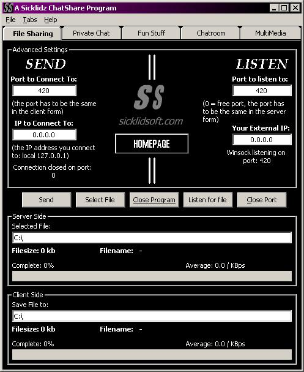

## SicklidShare2

### Description

This is a new version of SicklidShare witch is a Peer to peer filesharing program that now has a chatroom for multichat,ip-ping,portscanner and a mp3 player.We are currenty working on a multiperson filesharing.This is only a one on one fileshareing at the momment.There will be more to come in later versions.
 
### More Info
 
There are no known problems that we know of, if you find any please let us know.

             |
---                |---
**Submitted On**   |2001-06-13 12:51:10
**By**             |[N/A](https://github.com/Planet-Source-Code/PSCIndex/blob/master/ByAuthor/empty.md)
**Level**          |Intermediate
**User Rating**    |4.3 (17 globes from 4 users)
**Compatibility**  |VB 6\.0
**Category**       |[Internet/ HTML](https://github.com/Planet-Source-Code/PSCIndex/blob/master/ByCategory/internet-html__1-34.md)
**World**          |[Visual Basic](https://github.com/Planet-Source-Code/PSCIndex/blob/master/ByWorld/visual-basic.md)
**Archive File**   |[SicklidSha211146132001\.zip](https://github.com/Planet-Source-Code/sicklidshare2__1-24062/archive/master.zip)

